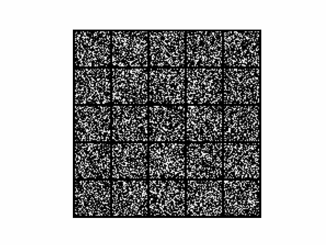

<div align="center">

# DIFFUSION MODEL

<a href="https://pytorch.org/get-started/locally/"></a>
<a href="https://pytorchlightning.ai/"></a>
<a href="https://hydra.cc/"></a>
<a href="https://github.com/ashleve/lightning-hydra-template"></a><br>
<!-- [](https://www.nature.com/articles/nature14539) -->
<!-- [](https://papers.nips.cc/paper/2020) -->

</div>

## Description

My implementation of Diffusion Model.

## Installation

#### Pip

```bash
# clone project
git clone https://github.com/phamgialinhlx/hydra-diffusion
cd hydra-diffusion

# [OPTIONAL] create conda environment
conda create -n diffusion python=3.9
conda activate diffusion

# install pytorch according to instructions
# https://pytorch.org/get-started/

# install requirements
pip install -r requirements.txt
```

## How to run

Train model with default configuration

```bash
# train on CPU
python src/train.py trainer=cpu

# train on GPU
python src/train.py trainer=gpu
```

[Inference](./notebooks/inference.ipynb)

## Results

Diffusion model on MNIST


Classifier-Free Guidance Diffusion Model on MNIST
